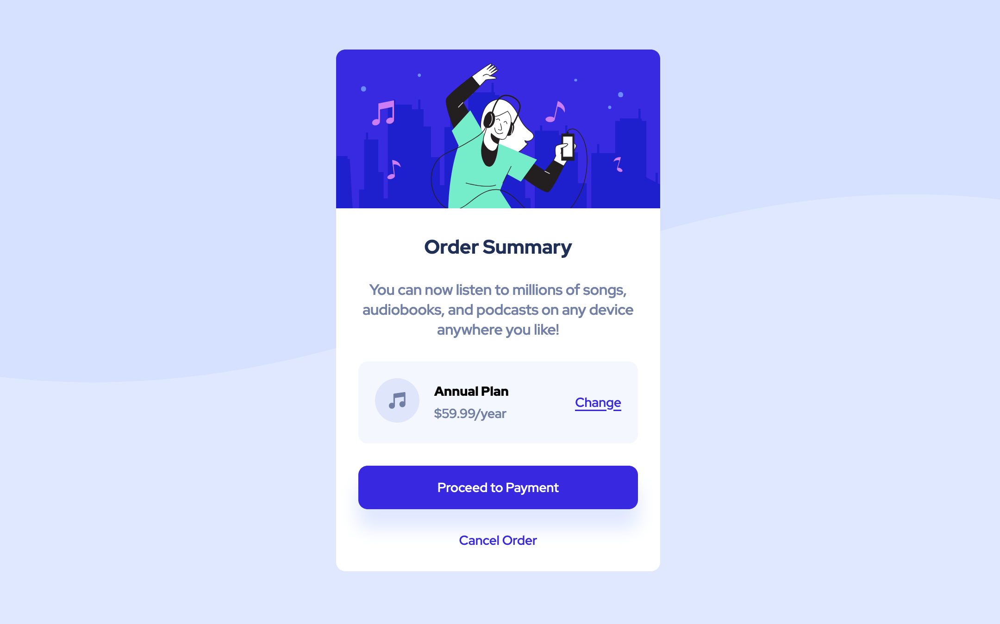

# Order summary component

This is a solution to the [Order summary component on Frontend Mentor](https://www.frontendmentor.io/challenges/order-summary-component-QlPmajDUj).

## Table of contents

- [Order summary component](#order-summary-component)
  - [Table of contents](#table-of-contents)
  - [Overview](#overview)
    - [The challenge](#the-challenge)
    - [Screenshot](#screenshot)
    - [Links](#links)
  - [My process](#my-process)
    - [Built with](#built-with)
    - [What I learned](#what-i-learned)
  - [Author](#author)
  

## Overview

### The challenge

Users should be able to:

- View the optimal layout depending on their device's screen size
- See hover states for interactive elements

### Screenshot



### Links

  - Solution URL: [HTML](https://github.com/MBaktygul/order-summary-component/blob/mbaktygul/index.html), [CSS](https://github.com/MBaktygul/order-summary-component/blob/mbaktygul/styles/style.css)
- Live Site URL: [Order summary component](https://mbaktygul.github.io/order-summary-component/)

## My process

### Built with

- Semantic HTML5 markup
- Scss
- Flexbox
- Mobile-first workflow

### What I learned

This project allowed me to reinforce and refresh my skills in ```semantic HTML```, ```CSS``` ```Flexbox```, ```SCSS```, ```mobile-first design```, ```SVG``` integration, and ```Git workflow```, while also renewing my understanding of accessibility best practices and the proper use of buttons versus links for actions. 

It strengthened my ability to create responsive, maintainable, and accessible web projects.

## Author

- Website - [Baktygul](https://github.com/MBaktygul)
- Frontend Mentor - [@MBaktygul](https://www.frontendmentor.io/profile/MBaktygul)

